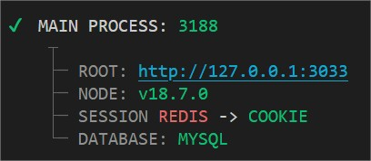

# About
A framework using a custom wrapper API to reduce the amount of dependencies and enforce the security. The goal is to greatly simplify the common tools with a friendly syntax and separate the framework architecture from the business logic.

Less code is better :)

### Dependencies
We try to reduce the amount of dependencies as much as possible by using the standart module.

## Install
As usual. You can also use the [boilerplate](https://github.com/Braije/betiny-boilerplate)

    yarn add betiny-core

Otherwise, create your own ".env" and fill it with your own informations

    NODE_ENV=dev

    # TODO: allow range
    HTTP_PORT=3001
    HTTP_HOST=127.0.0.1

    # File system will be restricted to this folder path.
    TEMP_PATH=
    
    # As usual.
    MYSQL_HOST=localhost
    MYSQL_PORT=3306
    MYSQL_USER=root
    MYSQL_PASSWORD=
    MYSQL_CONNECTION_LIMIT=100
    MYSQL_DATABASE=betiny

# API

    const $ = require('betiny-core'); 

- [Server](./api/core/server.md)
- [Routes](./api/core/routes.md)
- [Middleware](./api/core/middleware.md)
- [Session](./api/core/session.md)
- [Arguments](./api/core/arguments.md)
- [File system](./api/core/files.md)
- [Database](./api/core/mysql.md)
- [Events]
- [Utils]
- [System]
