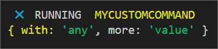
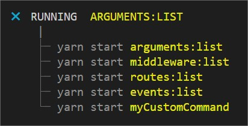

[Back to home](../../README.md)

## Arguments
Allow you to create your own shell command.

### $.arguments.add(NAME, COMMAND)

    $.arguments.add("myCustomCommand", args => {
        
        // List all extra key:value in your shell command.
        console.log(args);

        // Run any complexe process ...

        // ... and manage yourself the end!
        process.exit();

    })

Then run it ...

    yarn start myCustomCommand with:any more:value

.. this will produce:

## List
You can list any existing arguments 

    yarn start arguments:list 

