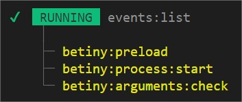

[Back to home](../../README.md)

## Events
A events manage to facilitate the communication between API **inside a single process**

### $.on(NAME, CALLBACK)
Allow you to catch any event `NAME` to peform any `CALLBACK` method.

    $.on("myCustomEvent", cfg => {
        console.log(cfg);
    });

### $.off(NAME)
Allow you to turn off any events by `NAME`

    $.off("myCustomEvent");

### $.once(NAME, CALLBACK)
Allow you to catch any event `NAME` to peform any `CALLBACK` method. The event will be remove after the first trigger event.

    $.once("myCustomEvent", cfg => {
        console.log(cfg);
    });

### $.fire(NAME, OPTIONS)
Trigger an event `NAME` with `OPTIONS`

    $.fire("myCustomEvent", { ... });

## Arguments 
You can get the list of existing FIRE events by using the command:

    yarn start events:list

