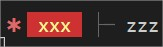

[Back to home](../../README.md)

# Log
Nothing special except a custom chainable method to manage the presentation inside the console.

## $.log
A really basic aliasing for `console.log`

    $.log("Any", true, 100, "as usual")

## $.draw()....finish()
A custom chainable method to manage color inside the console log.

    $.log(
        $.draw()
            .icon("error")
            .background("red")
            .color("yellow")
            .text(" xxx ")
            .reset()
            .space(1)
            .icon("child")
            .text(" zzz ")
        .finish()
    )

Will produce this in the console:

### How to?

#### $.draw <-- START
Use to initiate a new chain string contructor.
No output. 

#### .finish() <-- END
Use to terminate any chain string contructor. No output.

#### .text(ANY)
Use to define any STRING, NUMBER or BOOLEAN value in the chain.

    $.draw().text("COOL").finish()

#### .color(COLOR)
Allow you to define a color preset name.

    $.draw().color("cyan").text("COOL").finish()

#### .background(COLOR)
Allow you to define a background color preset name.

    $.draw().background("green").text("COOL").finish()

#### .space(NUMBER)
Allow you to define NUMBER blank spaces.

    $.draw().space(6).text("COOL").finish()

#### .icon(NAME)
Define a custom icon.

    $.draw().icon("error").text("COOL").finish()

#### .underline()
No comment :)

#### .strikethrough()
Idem :)

#### .italic()
Really need an explanation?

## Color and background
List of available colors

- red
- green
- blue
- gray
- cyan
- magenta
- yellow
- black
- white

## Icons
List of availale icons

- error
- top
- bottom
- end
- child
- plus
- pipe
- check
