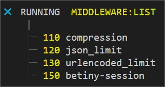

[Back to home](../../README.md)

## Middleware
Maybe the most flexible part of this framework. Allow you to add any middleware at **any time with priority order** in your business logic.

You can get the list of existing middleware and priority order by using the command:

    yarn start middleware:list

### $.middleware.add(NAME, PRIORITY, METHOD)

The `name` provide an indication of the purpose, and the `priority` specify the order inside all process.

    $.middleware.add("my custom middleware", 200, (req, res, next) => {
        next()
    })

The `req` object contains a global property `betiny` that can be use accros all routes and will be destroy at the end of the road. This object can be popuplate on any level.

Based on any value ...

    $.route.get("/", {any: "value", boolean: true}, (req, res, next) => { ... })

... you can catch them accros all middlewares, everywhere ;)

    $.middleware.add("custom 1", 200, (req, res, next) => {
        if (req.betiny.any === "value") { ... }
        next()
    })

    $.middleware.add("custom 2", 210, (req, res, next) => {
        if (req.betiny.boolean) { ... }
        next()
    })

    $.middleware.add("custom 3", 210, (req, res, next) => {
        if (req.betiny.boolean && req.betiny.any === "anotherValue") { ... }
        next()
    })

