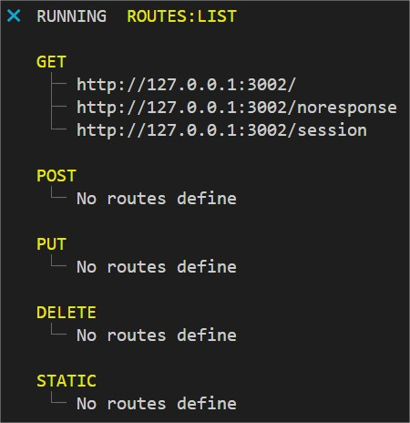

[Back to home](../../README.md)

### Routes
No surprise, route use [Express](https://expressjs.com/) behind the scene :-)

    const $ = require('betiny-core')

### API
Common arguments and parameters.

| Arguments | Description |
| --- | --- |
| path | **mandatory** Any valid path using the same pattern as Express |
| options | **optional** A JSON configuration. See [middleware](./middleware.md) |
| callback | **mandatory** The callback method |

#### $.route.get(path, options, callback)
Maybe the most common usage :)

    $.route.get("/", (req, res, next) => {
        res.send("Yeahhh")
    })

#### $.route.post(path, options, callback)
Post ...

    $.route.post("/", (req, res, next) => {
        res.send("Yeahhh")
    })

#### $.route.put(path, options, callback)
Update ...

    $.route.put("/", (req, res, next) => {
        res.send("Yeahhh")
    })

#### $.route.delete(path, options, callback)
Remove ...

    $.route.delete("/", (req, res, next) => {
        res.send("Yeahhh")
    })

#### $.route.static(from, to)
To delivery static assets ...

    $.route.static("/demo", __dirname + "/demo")

#### Arguments
An arguments is available to list all routes usage:

    yarn start routes:list

You can refine the list based on second arguments:

    yarn start routes:list method:get

