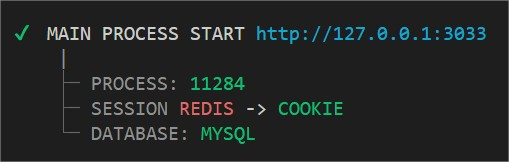

[Back to home](../../README.md)

### SESSION
The session is manage from server side and it's based on "redis" with a fallback based on cookie session.

The [ioredis](https://github.com/luin/ioredis) was choose because they have a better error manager.

Redis server is not mandatory once your server start. 
A fallback version exist to let you play locally based on cookie session.

The session use a Base64 (to improve).

The session is store as **JSON format**.

#### How to
The session API is available inside any `$.route` based on `req.session` property.

    $.route.get(..., (req, res, next) => {
        // req.session.XXX
    })

##### req.session.id
The session id is based on a custom GUID.

    // betiny_xxxxxxxx
    let mySessionId = req.session.id

##### req.session.set(key, value)
Allow you to setup any value based on "path". Paths are automatically create if not exist.

    // Classic key <=> value.
    req.session.set("anyKey", "anyValue")

    // Assign value based on path definition.
    req.session.set("any.path", { another: true })

##### req.session.get(key) : Promise
Allow you to retrieve any value based on "path". Null is return if not exist.

    // Return the full session object.
    let mySession = await req.session.get()

    // Return the value of "xxx.yyy" if exist or null.
    let myPath = await req.session.get("xxx.yyy")
